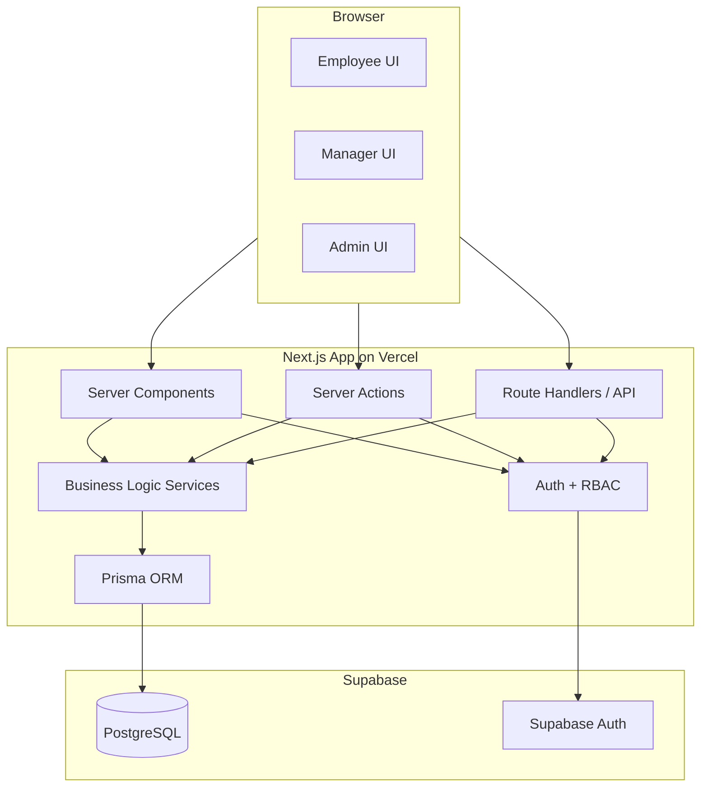
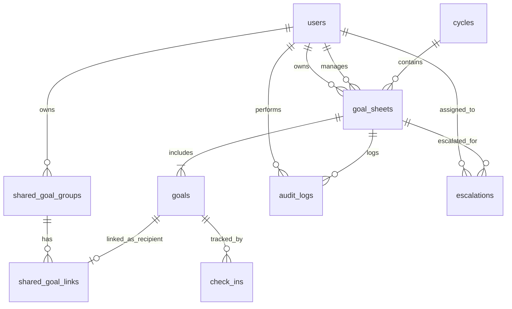
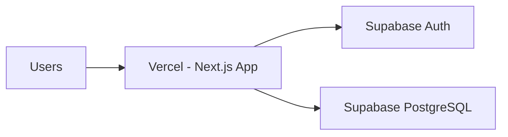

# ARCHITECTURE.md — System Architecture

## AtomQuest Hackathon 1.0 — In-House Goal Setting & Tracking Portal

**Version:** Lean Hackathon Edition  
**Scope:** Core BRD requirements + Good-to-Have 5.3 Escalation Module + 5.4 Analytics Module

## 1. Architecture Decision

This solution uses a **lean monolithic Next.js architecture** deployed on Vercel, backed by Supabase PostgreSQL and Supabase Auth. Prisma is used as the application ORM, while all business rules live inside the app in TypeScript services and server actions.

This is deliberate. The hackathon does not reward architectural complexity; it rewards working functionality, BRD adherence, low bug count, and a good demo. So the architecture includes only what is required to deliver the portal plus the chosen bonus features.

## 2. High-Level Architecture

### Summary

The system has four practical layers:

1. **Presentation Layer**  
   Next.js pages and components for Employee, Manager, and Admin.

2. **Application Layer**  
   Server Actions and Route Handlers that process requests, validate input, enforce role rules, and call services.

3. **Domain Logic Layer**  
   Pure TypeScript modules for validation, shared-goal sync, UoM score calculation, cycle window enforcement, audit logging, escalation checks, and analytics aggregation.

4. **Data Layer**  
   Supabase PostgreSQL accessed through Prisma, plus Supabase Auth for login/session handling.

### Mermaid — High-Level Diagram

## 3. Why this architecture is right-sized

This architecture is intentionally smaller than the earlier enterprise-style version.

Included:
- Multi-role web app
- Goal workflow
- Approval workflow
- Check-ins
- Reporting/export
- Audit trail
- Escalations
- Analytics

Excluded:
- Realtime subscriptions
- Teams integration
- Azure AD
- File upload system
- Notification platform
- Service decomposition
- Event-driven infrastructure

The result is easier to implement, easier to debug, and much safer for a hackathon demo.

## 4. Primary User Flows

### 4.1 Employee Flow

1. Login.
2. Create goal sheet for active cycle.
3. Add up to 8 goals, including any assigned shared goals.
4. Submit when total weightage = 100 and each goal is at least 10.
5. Adjust only weightage for assigned shared goals; shared title and target stay read-only.
6. During active quarter, enter actual achievement and status.
7. View locked goals and historical check-ins.

### 4.2 Manager Flow

1. Login.
2. Open pending approval queue.
3. Review submitted goal sheet.
4. Approve as-is, edit inline and approve, or return for rework.
5. Push shared departmental KPIs to selected direct reports.
6. Review quarterly check-ins for direct reports.
7. Add check-in comments and complete manager review.
8. View team completion and achievement analytics.

### 4.3 Admin Flow

1. Login.
2. Configure and activate cycle windows.
3. Manage or verify employee-manager hierarchy.
4. Push shared departmental KPIs when needed.
5. Unlock goal sheets when needed.
6. View audit logs.
7. Export achievement reports.
8. View organization-level completion dashboard and analytics.
9. Review escalation records.

## 5. Core Modules

| Module | Responsibility |
|---|---|
| Auth module | Login, session lookup, role extraction |
| Goal sheet module | Drafting, editing, submission, locking |
| Shared goal module | Push departmental KPIs, link recipient goals, enforce read-only shared metadata, sync primary-owner achievements |
| Approval module | Manager review, edits, return, approve |
| Check-in module | Quarterly actual entry, status update, manager review |
| Score engine | Compute progress score by UoM type and score direction |
| Cycle module | Active cycle and open-window enforcement |
| Org hierarchy module | Maintain employee-manager relationships for dashboards and escalations |
| Audit module | Append-only tracking of changes |
| Report module | Achievement report queries and export |
| Escalation module | Detect overdue submissions/approvals/check-ins |
| Analytics module | QoQ trends, completion rates, status distribution |

## 6. Database Design

### 6.1 Final tables to keep

| Table | Purpose |
|---|---|
| `users` | App users with role and reporting hierarchy |
| `cycles` | Goal-setting and check-in windows |
| `goal_sheets` | One sheet per employee per cycle |
| `goals` | Individual goals under a sheet |
| `shared_goal_groups` | Shared KPI source records pushed by Admin/Manager |
| `shared_goal_links` | Recipient goal links with per-employee weightage and primary-owner mapping |
| `check_ins` | Quarterly progress and manager review |
| `audit_logs` | Immutable change history |
| `escalations` | Overdue workflow tracking for feature 5.3 |

### 6.2 Optional table

| Table | Keep only if needed |
|---|---|
| `thrust_areas` | Use if thrust areas are admin-managed instead of hardcoded seed values |

### 6.3 Excluded tables

These are intentionally excluded from the lean build:
- `notifications`
- storage/file tables

Reason: they are not necessary for the must-have scope or the selected bonus set. Shared-goal tables are included because shared goals are Phase 1 must-have.

## 7. Simplified ER Model

## 8. Table-Level Design

### 8.1 `users`

Purpose:
- Stores app-level identity and reporting hierarchy.

Key fields:
- `id`
- `name`
- `email`
- `role` (`employee`, `manager`, `admin`)
- `manager_id`
- `department`
- `designation`
- `supabase_auth_id`

### 8.2 `cycles`

Purpose:
- Controls active windows for goal creation and quarterly check-ins.

Key fields:
- `id`
- `name`
- `goal_setting_start`, `goal_setting_end`
- `q1_start`, `q1_end`
- `q2_start`, `q2_end`
- `q3_start`, `q3_end`
- `q4_start`, `q4_end`
- `is_active`

### 8.3 `goal_sheets`

Purpose:
- One sheet per employee per cycle.

Key fields:
- `id`
- `user_id`
- `manager_id`
- `cycle_id`
- `status` (`draft`, `pending_approval`, `approved_locked`, `returned`)
- `return_comment`
- `submitted_at`
- `approved_at`

Constraint:
- Unique `(user_id, cycle_id)`

### 8.4 `goals`

Purpose:
- Stores individual goals in a goal sheet.

Key fields:
- `id`
- `goal_sheet_id`
- `title`
- `description`
- `thrust_area`
- `uom_type`
- `score_direction` (`higher_is_better`, `lower_is_better`, nullable for Timeline/Zero)
- `target`
- `weightage`
- `sort_order`
- `is_shared`
- `shared_goal_group_id` (optional)

Business rules:
- Max 8 goals per sheet
- Min 10 weightage per goal
- Total weightage must equal 100 before submit
- Shared goal recipients can edit only `weightage`
- Shared title, description, thrust area, UoM, score direction, and target are read-only for recipients

### 8.5 `shared_goal_groups`

Purpose:
- Stores the shared departmental KPI metadata and primary owner.

Key fields:
- `id`
- `created_by_user_id`
- `primary_owner_user_id`
- `cycle_id`
- `title`
- `description`
- `thrust_area`
- `uom_type`
- `score_direction`
- `target`
- `created_at`

### 8.6 `shared_goal_links`

Purpose:
- Links a shared KPI to recipient goal rows while allowing employee-specific weightage.

Key fields:
- `id`
- `shared_goal_group_id`
- `goal_id`
- `recipient_user_id`
- `is_primary_owner`
- `created_at`

Constraint:
- Unique `(shared_goal_group_id, recipient_user_id)`

### 8.7 `check_ins`

Purpose:
- Stores employee achievement and manager review per quarter.

Key fields:
- `id`
- `goal_id`
- `quarter`
- `actual_value`
- `status`
- `computed_score`
- `employee_comment`
- `manager_comment`
- `manager_checked_in`
- `employee_submitted_at`
- `manager_checked_in_at`

Constraint:
- Unique `(goal_id, quarter)`

### 8.8 `audit_logs`

Purpose:
- Captures all important changes, especially after locking and admin unlock actions.

Key fields:
- `id`
- `user_id`
- `goal_sheet_id`
- `goal_id` (optional)
- `action`
- `field_changed`
- `old_value`
- `new_value`
- `reason`
- `created_at`

### 8.9 `escalations`

Purpose:
- Tracks overdue goal submissions, approvals, and quarterly check-ins.

Key fields:
- `id`
- `goal_sheet_id`
- `user_id`
- `rule_type`
- `escalation_level`
- `status`
- `triggered_at`
- `resolved_at`

## 9. UoM Score Computation

The score engine should be a pure service module, not spread across UI components. Numeric and percentage goals require both `uom_type` and `score_direction`; UoM alone is not enough to know whether higher or lower values are better.

Rules:
- **Min / higher-is-better Numeric / %:** score = achievement / target
- **Max / lower-is-better Numeric / %:** score = target / achievement
- **Timeline:** completed by or before deadline = success, else not complete
- **Zero-based:** 0 = success, anything else = failure

Application note:
- Cap scores at 100% for display unless the product explicitly wants overachievement visibility.
- Keep raw values available for reports if needed.

## 10. API / Server Action Surface

### 10.1 Core mutations

| Function | Role |
|---|---|
| `createGoalSheet` | Employee |
| `updateGoalSheet` | Employee |
| `submitGoalSheet` | Employee |
| `approveGoalSheet` | Manager |
| `returnGoalSheet` | Manager |
| `pushSharedGoal` | Manager/Admin |
| `updateSharedGoalRecipientWeightage` | Employee |
| `saveCheckIn` | Employee |
| `completeManagerCheckIn` | Manager |
| `createCycle` | Admin |
| `activateCycle` | Admin |
| `updateOrgHierarchy` | Admin |
| `unlockGoalSheet` | Admin |

### 10.2 Core reads

| Route / Query | Role |
|---|---|
| `getMyGoalSheet` | Employee |
| `getSharedGoalGroup` | Manager/Admin |
| `getPendingApprovals` | Manager |
| `getTeamCheckIns` | Manager |
| `getAuditLogs` | Admin |
| `getAchievementReport` | Manager/Admin |
| `getCompletionDashboard` | Manager/Admin |
| `getAnalyticsDashboard` | Manager/Admin |
| `getEscalations` | Admin |

## 11. Escalation Module Design (Feature 5.3)

### Scope

Implement only rule-based escalation for:
- Employee has not submitted goals within N days of cycle opening.
- Manager has not approved goals within N days of submission.
- Quarterly check-in not completed within active window.
- Escalation chain progression from employee to manager to skip-level / HR after configured intervals.

### Lean implementation

Use one scheduled job only. It can be:
- Supabase scheduled function, or
- a simple cron-triggered server route if easier in deployment.

The scheduled process should:
1. Query overdue goal sheets or check-ins.
2. Create or update an `escalations` record.
3. Mark escalation level and status.
4. Advance chain state when the configured interval passes.
5. Surface these in the Admin UI.

Optional:
- show reminders in-app
- send email or Teams messages only if time remains

Important: the hackathon score comes from visible working logic, not from building a sophisticated notification infrastructure.

## 12. Analytics Module Design (Feature 5.4)

### Scope

Implement only these analytics views:
- QoQ goal achievement trend
- completion rate by quarter
- goal distribution by status
- goal distribution by thrust area or UoM type
- manager completion dashboard

### Lean implementation

Use aggregation queries from PostgreSQL/Prisma and return chart-ready JSON to the frontend. Render using Recharts.

Recommended charts:
- Line chart: QoQ achievement trend
- Bar chart: completion rates by quarter
- Pie/Donut chart: status distribution
- Bar chart: manager-wise completion comparison

Do not build a generic analytics engine. Build 3-4 fixed dashboards only.

## 13. Security Model

Use practical security, not maximum-security architecture.

Required:
- Supabase Auth for login
- role-aware route protection
- server-side authorization checks on all mutations
- audit logs for sensitive changes

Optional:
- focused RLS for core tables if time permits

For this hackathon, app-level RBAC is enough if implemented correctly and tested well.

## 14. Deployment Architecture

Deployment pieces:
- Vercel for app hosting
- Supabase for auth and database
- GitHub for source control

This satisfies the hackathon deliverable needs without introducing infrastructure overhead.

## 15. Demo-First Implementation Order

1. Auth and role-based login
2. Employee goal creation with validation
3. Manager approval / return / lock
4. Shared goals push, recipient weightage edit, and primary-owner achievement sync
5. Employee quarterly check-in
6. Manager check-in review
7. Admin cycle activation, org hierarchy management, and unlock
8. Audit trail
9. Achievement report export
10. Analytics dashboard
11. Escalation module

This order ensures the must-have flow is stable before the selected bonus features are added.

## 16. Submission Deliverables

The delivery package must include:
- Live / hosted demo URL.
- Source code repository link.
- Architecture diagram exported as PDF or image.
- Demo login credentials for Employee, Manager, and Admin, or an in-app role-switching option.

## 17. Final Conclusion

This architecture is intentionally right-sized for AtomQuest Hackathon 1.0. It covers all must-have BRD requirements, including shared goals and org hierarchy management, and exactly two bonus features — escalation and analytics — while avoiding the unnecessary complexity that would increase bug risk and slow implementation.
