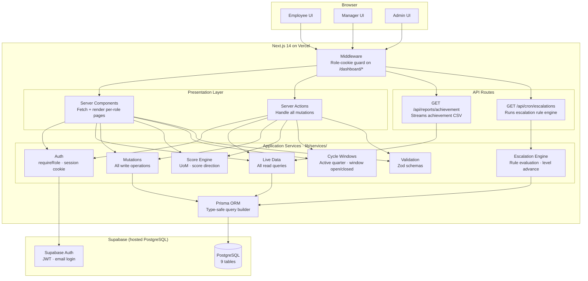
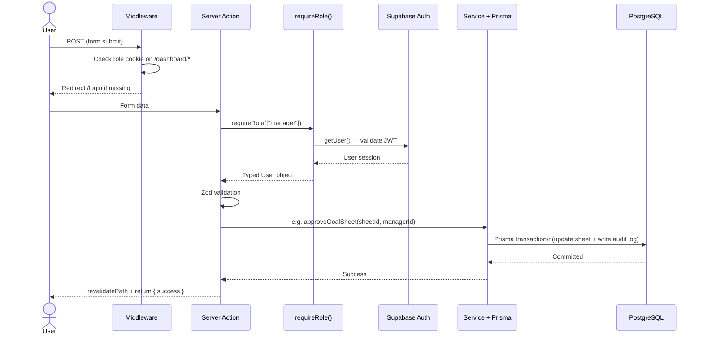
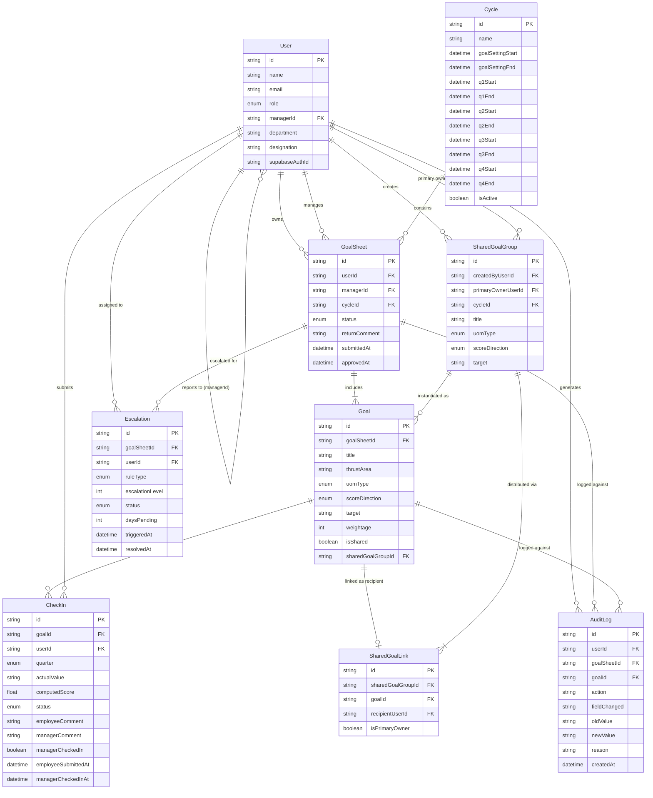
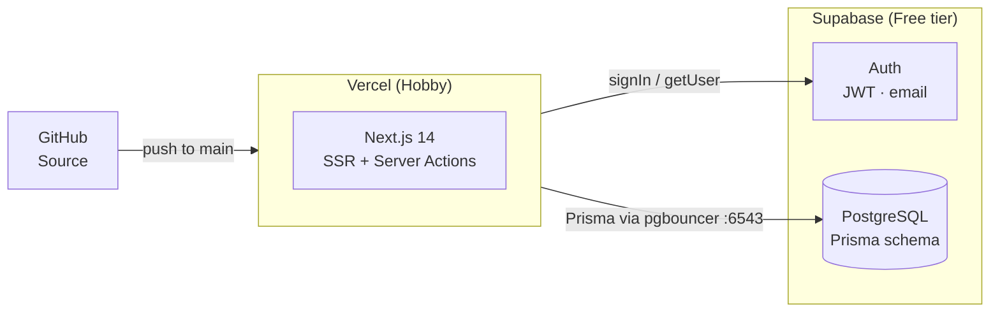

# Tracko — Architecture

**Stack:** Next.js 14 App Router · TypeScript · Prisma · Supabase PostgreSQL · Supabase Auth · Vercel

---

## 1. System Architecture

---

## 2. Request Lifecycle — Typical Mutation

---

## 3. Data Model

---

## 4. Module Map

| Module | Location | Responsibility |
|---|---|---|
| Auth | `lib/auth/` | `requireRole()`, session cookie read, Supabase session |
| Live Data | `lib/services/live-data.ts` | All read queries — goal sheets, check-ins, analytics |
| Mutations | `lib/services/mutations.ts` | All write operations — approve, submit, unlock, push shared |
| Score Engine | `lib/services/score-engine.ts` | Pure UoM score computation — numeric, %, timeline, zero |
| Escalation Engine | `lib/services/escalations.ts` | Rule evaluation, level advance, `/api/cron/escalations` |
| Cycle Windows | `lib/services/windows.ts` | Active quarter detection, window open/closed checks |
| Validation | `lib/validation/` | Zod schemas for all server action inputs |
| Server Actions | `app/actions/` | Thin orchestrators — validate → auth → service → revalidate |
| Reports | `lib/services/reports.ts` | Achievement CSV generation |

---

## 5. Role & Feature Matrix

| Feature | Employee | Manager | Admin |
|---|:---:|:---:|:---:|
| Create & submit goal sheet | ✅ | | |
| Enter quarterly actuals (check-in) | ✅ | | |
| View check-in history | ✅ | | |
| Approve / return / edit goal sheet | | ✅ | |
| Push shared departmental KPIs | | ✅ | ✅ |
| Review team check-ins + add comments | | ✅ | |
| Team analytics | | ✅ | |
| Activate cycle & configure windows | | | ✅ |
| Manage org hierarchy | | | ✅ |
| Unlock approved goal sheet | | | ✅ |
| View escalations & resolve | | | ✅ |
| Export achievement CSV | | | ✅ |
| Org-wide analytics (5 charts) | | | ✅ |
| Audit log | | | ✅ |

---

## 6. Deployment

**Cost: $0.** Vercel Hobby + Supabase free tier covers the full production workload.
